# ARCHITECTURE.md

> **用途：**当前 Godot 工程的主要人类可读架构地图。本文把保存到磁盘的 SceneTree、当前源码支持的运行时数据流、跨脚本契约与已确认但尚未实现的目标架构分开记录。
>
> **事实来源：**当前 `project.godot`、真实 `.tscn` / `.gd` / `.tres`。`Docs/AI_CONTEXT.md` 仅用于系统职责和已确认的长期决定；`PROJECT_DUMP.md` 未作为事实来源。
>
> **本次刷新基线：**2026-09-21。Editor MCP 当时未连接，因此 `[LIVE]` 表示已由当前工作区保存文件直接核实；需要未保存 Editor 状态或实际运行证据的项目仍标为 `[VERIFY]`。

---

## 0. 图例与状态

### 0.1 关系约定

- Mermaid 实线 `-->`：SceneTree 父子、实例化子场景或 Autoload 挂载关系。
- Mermaid 带标签虚线 `-. "..." .->`：运行时 command、method call、signal 或 data flow。
- `Resource` / `RefCounted` 只出现在数据流图，不伪装成 SceneTree child。

### 0.2 状态标签

| 标签 | 含义 |
| --- | --- |
| `[LIVE]` | 已由当前真实工作区或 Editor 状态核实 |
| `[SOURCE]` | 当前源码支持，但尚未以 live Editor / runtime 行为验证 |
| `[TARGET]` | 已确认的目标架构；不表示已经实现 |
| `[LEGACY]` | 当前仍存在但计划替换或移除的旧实现 |
| `[VERIFY]` | 证据不足；不猜测 |

---

# Part I — SceneTree / Node-Script structure

## 1. 应用入口与 Autoload

### 1.1 当前保存态 `[LIVE]`

`project.godot` 当前配置：

- main scene：`res://MainMenuSystem/MainMenu.tscn`（UID `uid://cu8ebs30en5qs`）。
- gameplay Autoload：`GameManager`、`SaveManager`、`AllCardData`、`AllEnemyData`。
- `godot_mcp_runtime` 也是 Autoload，但属于开发基础设施，不属于 gameplay architecture。
- `PlayerSaveManager.gd` 存在，但当前不是 Autoload，也未在已检查场景中挂载。
- `MainMenu.tscn` 当前只有无脚本的根节点 `MainMenu`。

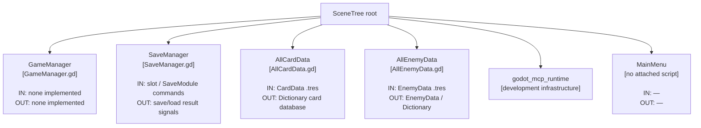

`GameManager.gd`、`PlayerSaveManager.gd` 都仍是 `_ready()` / `_process()` 占位脚本。`ExpeditionSystem.tscn` 当前没有从 main scene 或 `GameManager` 接入。`[LIVE]`

---

## 2. `ExpeditionSystem/ExpeditionSystem.tscn`

### 2.1 当前 SceneTree `[LIVE]`

根节点在场景文件中实际序列化为 `Expedition‌System`（`Expedition` 与 `System` 之间包含不可见字符），且没有 attached script。

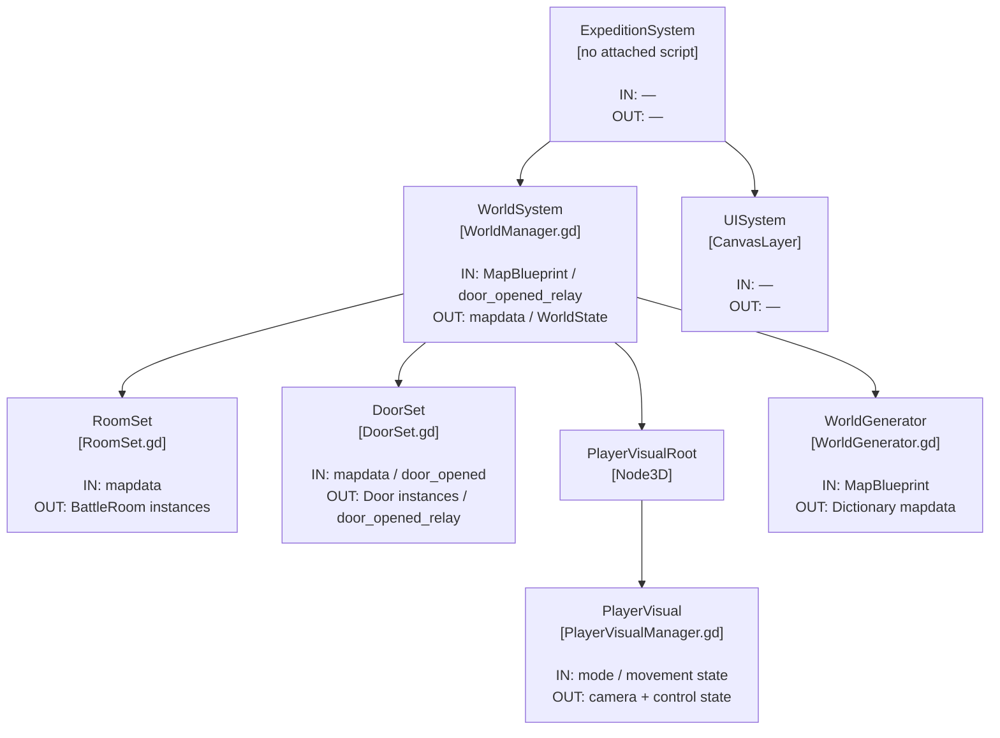

当前场景明确**没有**：

- `ExpeditionManager` 节点或 `ExpeditionManager.gd` 挂载；
- `BattleSystem.tscn` 实例；
- expedition-level save module。

### 2.2 `WorldSystem` 重要导出接线 `[LIVE]`

| Owner | `@export` | 当前保存值 |
| --- | --- | --- |
| `WorldManager` | `world_generator: WorldGenerator` | `WorldGenerator` |
| `WorldManager` | `room_set: RoomSet` | `RoomSet` |
| `WorldManager` | `door_set: DoorSet` | `DoorSet` |
| `WorldManager` | `player_visual: PlayerVisualManager` | `PlayerVisualRoot/PlayerVisual` |
| `WorldManager` | `default_blueprint: MapBlueprint` | `test_mapblueprint.tres` |
| `RoomSet` | `battle_room_scene: PackedScene` | `BattleRoom.tscn` |
| `DoorSet` | `door_scene: PackedScene` | `Door.tscn` |

### 2.3 动态房间与门结构 `[LIVE]`

`RoomSet` 和 `DoorSet` 的运行时 child 由代码实例化；下图中 `BattleRoom instances` / `Door instances` 是动态子节点，不是 `.tscn` 中预先列出的固定 children。

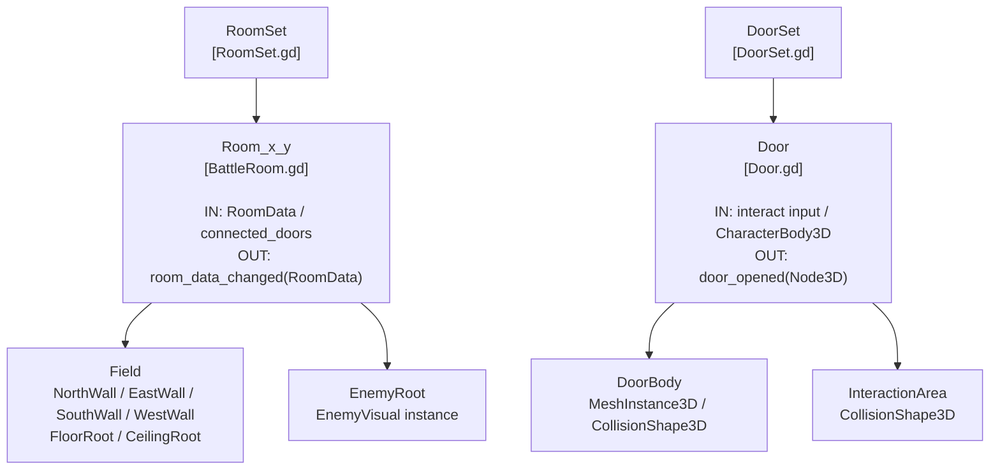

### 2.4 `PlayerVisual.tscn` `[LIVE]`

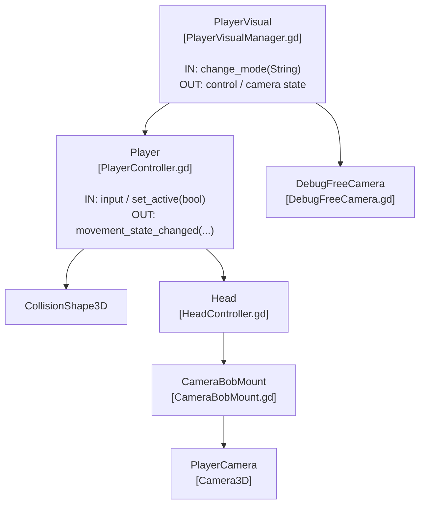

---

## 3. `ExpeditionSystem/BattleSystem/BattleSystem.tscn`

### 3.1 当前 SceneTree `[LIVE]`

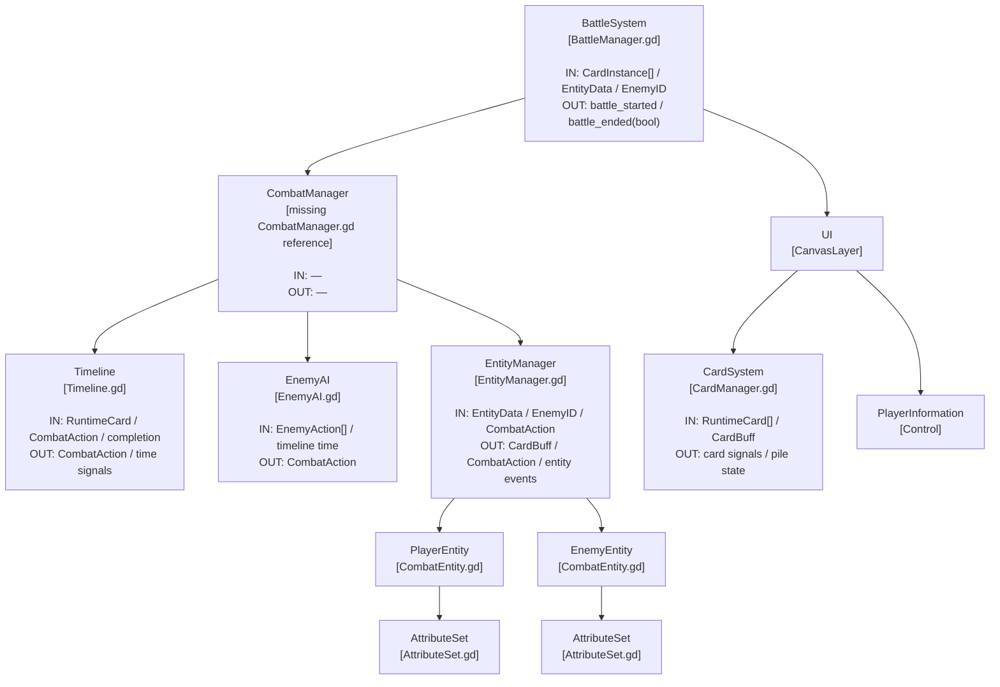

### 3.2 当前保存态接线 `[LIVE]`

| Owner | `@export` | 当前保存值 | 结果 |
| --- | --- | --- | --- |
| `BattleManager` | `timeline: Timeline` | 未绑定 | Battle → Timeline 调用当前无有效引用 |
| `BattleManager` | `entity_manager: EntityManager` | 未绑定 | Battle → Entity 调用当前无有效引用 |
| `BattleManager` | `card_manager: CardManager` | `UI/CardSystem` | 已绑定 |
| `BattleManager` | `battle_save_module: Node` | 未绑定 | legacy save 路径未挂载 |
| `EntityManager` | `player_entity: CombatEntity` | `PlayerEntity` | 已绑定 |
| `EntityManager` | `enemy_entity: CombatEntity` | `EnemyEntity` | 已绑定 |
| `EntityManager` | `enemy_ai: Node` | 未绑定 | AI signal / initial planning 当前不会由该引用接通 |
| `CombatEntity` (player) | `attribute_set: AttributeSet` | `AttributeSet` | 已绑定 |
| `CombatEntity` (enemy) | `attribute_set: AttributeSet` | `AttributeSet` | 已绑定 |

`CombatManager` 节点仍引用 `res://ExpeditionSystem/BattleSystem/CombatSystem/Scripts/CombatManager.gd`，但当前工作区不存在该文件。节点同时保存了 `timeline = NodePath("Timeline")` 与 `enemy_ai = NodePath("EnemyAI")`，但缺失脚本使这些旧导出值没有可用 owner。此节点是当前保存态中的 `[LIVE][LEGACY]` 断引用，不是要恢复的目标架构。

### 3.3 `CardSystem` SceneTree `[LIVE]`

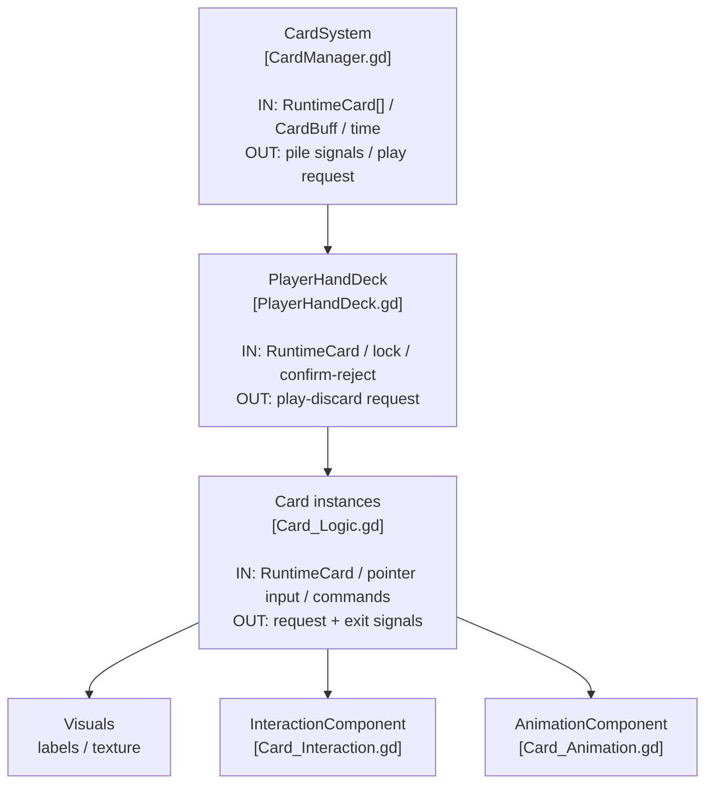

`CardManager.player_hand_deck` 当前绑定到 `PlayerHandDeck`，`PlayerHandDeck.card_scene` 当前绑定到 `Card.tscn`；`CardLogic` 的文本、交互和动画导出引用均在 `Card.tscn` 中绑定。`[LIVE]`

---

## 4. 目标顶层 SceneTree `[TARGET]`

此图只表示已经确认的长期方向，不表示当前 `.tscn` 已实现。

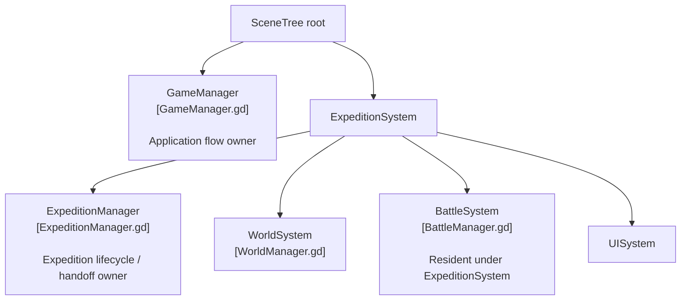

目标约束：

- `GameManager` 负责 Base ↔ Expedition 等应用级流程。
- `ExpeditionManager` 是探索 ↔ 战斗唯一上层协调器。
- `PlayerSaveManager` 是长期玩家数据的权威 owner。
- `BattleSystem` 常驻于 `ExpeditionSystem`，不是遭遇时临时创建。
- 远征最终只使用一个 expedition-level save module。
- 当前不要求旧存档兼容。

`PlayerSaveManager` 的 owner 职责已确认，但其未来挂载位置尚未确认，因此不在 TARGET SceneTree 中猜测父节点。expedition-level save module 的具体基类也尚未定义；若继续沿用 `SaveModule`，它将是 `RefCounted`，只能出现在数据流图中，不能画成 SceneTree child。`[TARGET][VERIFY]`

# Part II — Runtime data flow

## 5. 当前世界生成与遭遇流程

### 5.1 地图生成 `[SOURCE]`

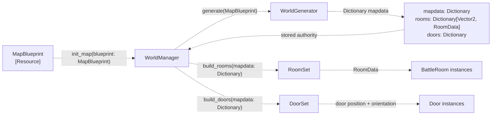

`WorldManager` 当前拥有 `mapdata`、`current_room_coords` 和 `current_state`。`WorldGenerator` 生成 `RoomData` 并通过 `AllEnemyData` 选择 `EnemyID`，但不拥有运行时地图状态。

### 5.2 当前遇敌上报机制 `[SOURCE]`

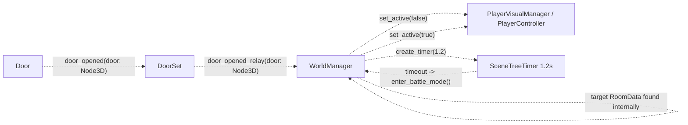

当前没有 encounter signal、`EncounterFact` 类型或到 `ExpeditionManager` 的上报接口。`WorldManager._on_door_opened()` 直接更新 `current_room_coords` 并调用 `enter_preparing_battle_mode(target_room)`；计时器随后直接调用 `enter_battle_mode()`。`enter_battle_mode()` 没有调用 `BattleManager.start_battle()`，反而重新启用 `PlayerController`。

`finish_battle()` 是未被当前工程连接的外部回调入口，只把当前 `RoomData.has_enemies` 设为 `false`，不清空 `enemy_id`，然后返回 explore mode。当前没有 `BattleManager.battle_ended` → `WorldManager.finish_battle()` 连接。`[SOURCE]`

---

## 6. 当前战斗启动与子系统协调

### 6.1 精确启动接口 `[SOURCE]`

```gdscript
func start_battle(
	external_deck: Array[CardInstance],
	external_player_data: EntityData,
	enemy_id: int
) -> void
```

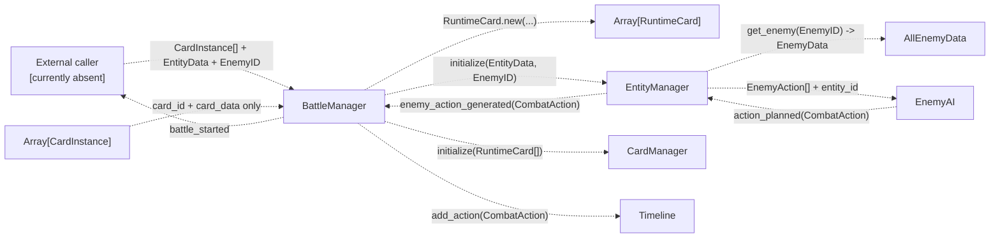

该图描述当前脚本意图，不表示当前保存场景可完成此链：`BattleManager.timeline`、`BattleManager.entity_manager` 与 `EntityManager.enemy_ai` 未绑定，且 `BattleSystem.tscn` 有缺失脚本引用。接线阻塞为 `[LIVE]`，流程为 `[SOURCE]`。

`CardInstance.modifiers` 和 `CardInstance.unique_id` 没有传入 `RuntimeCard`；当前转换只使用 `card_id` 与 `card_data`。`[SOURCE]`

### 6.2 玩家出牌、Timeline 与行动完成 `[SOURCE]`

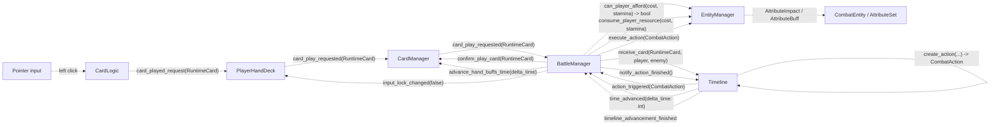

当前实现中的重要事实：

- `RuntimeCard.get_resource_cost()` 对 attack 取 `stamina_cost`，对其他牌取 `mana_cost`；但 `BattleManager` 始终以 `"stamina"` 校验和扣费。
- `Timeline` 拥有 `current_time`、`action_line` 和 `is_advancing`；它等待 `notify_action_finished()` 后继续推进。
- `BattleManager` 在每个 `CombatAction` 后通知 Timeline 完成；如果收到视觉请求，会等待 `notify_visual_completed()` 清除 `_is_waiting_for_visual`。
- `EntityManager.execute_action()` 会对每个 `action.card_buffs` 发出 `card_buff_requested`；`BattleManager._on_timeline_action_triggered()` 又直接遍历同一 `action.card_buffs`，因此当前存在两条 CardBuff 应用路径。

### 6.3 EnemyAI 规划 `[SOURCE]`

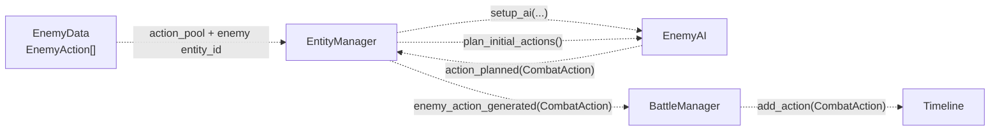

`plan_next_action(current_timeline_time: int)` 已实现，但当前源码没有在行动完成或 Timeline 推进完成后再次调用它；连续规划链当前未接通，不再标为模糊的 `[VERIFY]`。另外，保存场景中 `EntityManager.enemy_ai` 未绑定，所以连首次规划也不会通过该引用启动。连续规划结论为 `[SOURCE]`，保存接线为 `[LIVE]`。

### 6.4 战斗结束 `[SOURCE]`

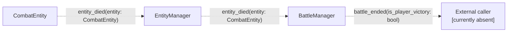

当前输出是 `bool`，不是 `BattleResult`。工程中没有已实现的 `BattleResult` 类型，也没有 `battle_ended` 的接收者；返回探索的闭环尚未实现。

---

## 7. RuntimeCard 与牌堆数据路径

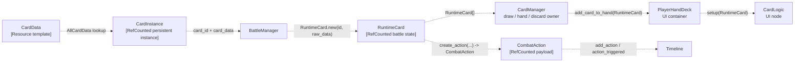

`CardManager.draw_pile`、`hand_pile`、`discard_pile` 是牌堆权威状态；`PlayerHandDeck` / `CardLogic` 只是 UI。`RuntimeCard.active_buffs` 是单卡战斗期 Buff 状态。`RuntimeCard.to_dictionary()` 当前只写 `card_id` 与 `card_data`，不写 `active_buffs`。`[SOURCE]`

---

## 8. 存档架构

### 8.1 当前实现 `[LIVE]` / `[SOURCE]`

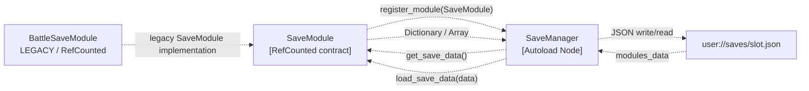

当前事实：

- `SaveManager` 是 Autoload，拥有 slot、metadata、module registry 与 JSON file I/O。
- 当前工作区没有 `WorldSaveModule.gd`。
- `BattleSaveModule.gd` 文件仍存在，但没有挂载到 `BattleSystem.tscn`，也没有发现当前注册调用链。
- `BattleManager.battle_save_module` 未绑定；其启动代码期待 `save_initial_state(...)`，而 `BattleSaveModule.gd` 没有该方法。
- `BattleSaveModule.gd` 仍读取不存在的 `EntityData.base_attributes` / `EnemyData.base_attributes`，并以不兼容参数调用 `EntityData.new(...)`；这是已知异常，不在本文档任务中修复。
- `PlayerSaveManager.gd` 当前只是占位脚本，未挂载、未注册存档模块，也尚未持有长期玩家数据。

因此 `BattleSaveModule` 标为 `[LEGACY]`，不能视为当前可靠的战斗恢复真相。

### 8.2 目标存档关系 `[TARGET]`

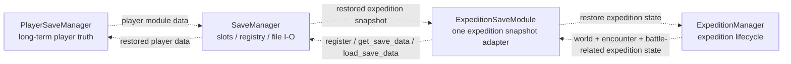

目标是一个 expedition-level save module 统一保存整次 `ExpeditionSystem` 所需状态，而不是 World/Battle 各维护独立真相。旧存档兼容当前不要求。具体 snapshot schema 与 public method signatures 尚未定义，保持 `[TARGET][VERIFY]`。

# Part III — Script contracts

## 9. 应用与远征层

| Script | Public / external methods | Signals | Important exports / state ownership | Status |
| --- | --- | --- | --- | --- |
| `GameManager.gd` | 无已实现架构入口 | 无 | 当前不持有应用状态；目标为 application flow owner | `[LIVE]` placeholder / `[TARGET]` role |
| `ExpeditionManager.gd` | 无已实现架构入口 | 无 | 当前未挂载、不持有 expedition context；目标为 explore↔battle 唯一 coordinator | `[LIVE]` placeholder / `[TARGET]` role |
| `PlayerSaveManager.gd` | 无已实现架构入口 | 无 | 当前未挂载、不持有长期玩家数据；目标为 long-term player data owner | `[LIVE]` placeholder / `[TARGET]` role |

这三个目标 owner 的精确 public contract 尚未实现，不能从目标职责反推方法名或参数。`[TARGET][VERIFY]`

---

## 10. World contracts

### 10.1 `WorldManager.gd` `[SOURCE]`

**Public / external methods**

| Signature | IN | Return / OUT |
| --- | --- | --- |
| `init_map(blueprint: MapBlueprint = null) -> void` | optional `MapBlueprint` | 更新 `mapdata`、构建 rooms/doors、进入 explore |
| `enter_explore_mode() -> void` | — | `current_state = EXPLORE`；调用 `player_visual.change_mode("explore")` |
| `enter_preparing_battle_mode(target_room: RoomData) -> void` | `RoomData` | `current_state = PREPARING_BATTLE`；锁定 player；创建 timer |
| `enter_battle_mode() -> void` | — | `current_state = BATTLE`；当前重新启用 player |
| `finish_battle() -> void` | — | 当前房间 `has_enemies = false`；进入 explore |

**Signals：**无。

**Exports：**`world_generator: WorldGenerator`、`room_set: RoomSet`、`door_set: DoorSet`、`player_visual: PlayerVisualManager`、`default_blueprint: MapBlueprint`。

**Owned state：**`current_state: WorldState`、`mapdata: Dictionary`、`current_room_coords: Vector2`。

### 10.2 其他 World scripts `[SOURCE]`

| Script | Public / external methods | Signals | Important exports / owned state |
| --- | --- | --- | --- |
| `WorldGenerator.gd` | `generate(blueprint: MapBlueprint) -> Dictionary` | 无 | 无 cross-node export；输出 `rooms` / `doors` mapdata，不持有长期运行时地图 |
| `RoomSet.gd` | `build_rooms(mapdata: Dictionary) -> void`; `clear_rooms() -> void` | 无 | `battle_room_scene: PackedScene`；拥有动态 room nodes，不拥有 `RoomData` 权威状态 |
| `DoorSet.gd` | `build_doors(blueprint: Dictionary) -> void`; `clear_doors() -> void` | `door_opened_relay(door: Node3D)` | `door_scene: PackedScene`；拥有动态 door nodes |
| `BattleRoom.gd` | `set_room_data(new_data: RoomData) -> void`; `build_room() -> void`; `set_player_inside(inside: bool) -> void`; `set_player_nearby(nearby: bool) -> void`; `clear_enemies() -> void` | `room_data_changed(updated_data: RoomData)` | wall/floor/ceiling/enemy Node refs 与 PackedScenes；引用 `room_data`，局部展示 `enemy_id` |
| `PlayerVisualManager.gd` | `change_mode(mode: String) -> void` | 无 | player/head/bob/camera refs；拥有 `current_mode` 表现状态 |
| `PlayerController.gd` | `set_active(active: bool) -> void` | `movement_state_changed(delta: float, current_speed: float, is_on_floor: bool, is_sprinting: bool)` | movement tuning；拥有 `is_active` 与移动速度 |

---

## 11. Battle coordination contracts

### 11.1 `BattleManager.gd` `[SOURCE]`

**Public / external methods**

| Signature | IN | Return / OUT |
| --- | --- | --- |
| `start_battle(external_deck: Array[CardInstance], external_player_data: EntityData, enemy_id: int) -> void` | `CardInstance[]`, `EntityData`, `EnemyID` | 初始化 Entity/Card；emit `battle_started` |
| `notify_visual_completed() -> void` | — | 清除视觉等待标志，使待执行 action 可继续 |

**Signals**

```text
battle_started
battle_ended(is_player_victory: bool)
input_lock_changed(is_locked: bool)
visual_effect_requested(visual_type: String, data: Dictionary)
```

**Exports：**`timeline: Timeline`、`entity_manager: EntityManager`、`card_manager: CardManager`、`battle_save_module: Node`。

**Owned state：**`is_battle_active: bool`、视觉等待状态；不拥有牌堆、实体属性或 Timeline queue。

### 11.2 `EntityManager.gd` `[SOURCE]`

**Public / external methods**

| Signature | IN | Return / OUT |
| --- | --- | --- |
| `initialize(player_data: EntityData, enemy_id: int) -> void` | `EntityData`, `EnemyID` | 初始化 player/enemy，向 AI 传 `EnemyAction[]` |
| `can_player_afford(cost: int, resource_name: String = "stamina") -> bool` | cost + attribute name | `bool` |
| `consume_player_resource(cost: int, resource_name: String = "stamina") -> void` | cost + attribute name | 修改 player `Attribute` |
| `execute_action(action: CombatAction) -> void` | `CombatAction` | 应用 `AttributeImpact` / `AttributeBuff`；emit CardBuff request |

**Signals**

```text
visual_effect_generated(visual_type: String, data: Dictionary)
card_buff_requested(target_id: String, buff: CardBuff)
enemy_action_generated(action: CombatAction)
entity_died(entity: CombatEntity)
```

**Exports：**`player_entity: CombatEntity`、`enemy_entity: CombatEntity`、`enemy_ai: Node`。

**State ownership：**实体节点路由与初始化协调；实际属性由各 `CombatEntity.attribute_set` 持有。

### 11.3 `Timeline.gd` `[SOURCE]`

**Public / external methods**

| Signature | IN | Return / OUT |
| --- | --- | --- |
| `add_action(action: CombatAction) -> void` | `CombatAction` | 排序 queue；emit snapshot |
| `receive_card(runtime_card: RuntimeCard, source_id: String = "player", target_id: String = "enemy") -> void` | `RuntimeCard`, source/target IDs | 创建 `CombatAction` 并推进逻辑时间 |
| `advance_timeline_to(target_time: int) -> void` | absolute logical time | emit action/time/completion signals |
| `notify_action_finished() -> void` | — | 释放当前 action wait |
| `pop_next_action_before_or_equal(target_time: int) -> CombatAction` | target logical time | next action or `null`，并从 queue 移除 |
| `get_last_enemy_action_time() -> int` | — | latest enemy trigger time / current time |
| `clear_enemy_actions(target_time: int) -> void` | cutoff time | 删除 cutoff 以前（含）的 enemy actions |

**Signals**

```text
timeline_data_updated(current_time: int, action_line: Array[CombatAction])
action_triggered(action: CombatAction)
timeline_advancement_finished
time_advanced(delta_time: int)
```

`_action_completed_step` 是内部协程同步 signal，不是外部架构契约。

**Owned state：**`current_time: int`、`action_line: Array[CombatAction]`、`is_advancing: bool`。

### 11.4 `EnemyAI.gd` `[SOURCE]`

| Signature | IN | Return / OUT |
| --- | --- | --- |
| `setup_ai(action_pool: Array[EnemyAction], entity_id: String = "enemy", target_id: String = "player") -> void` | `EnemyAction[]`, caster/target IDs | 缓存行动池并重置 cooldown/planning state |
| `plan_initial_actions() -> void` | — | 调用 `plan_next_action(0)` |
| `plan_next_action(current_timeline_time: int) -> void` | logical timeline time | weighted selection；emit `CombatAction` 或无输出 |

Signal：`action_planned(action: CombatAction)`。

Owned state：`_action_pool`、caster/target IDs、`_cooldown_tracker`、`_last_planned_time`。

### 11.5 Entity layer `[SOURCE]`

| Script | Public / external methods | Signals | Important exports / state |
| --- | --- | --- | --- |
| `CombatEntity.gd` | `initialize_from_data(data: EntityData) -> void`; `apply_attribute_impact(impact: CombatAction.AttributeImpact) -> void`; `apply_entity_buff(attr_name: String, buff: AttributeBuff) -> void` | `visual_requested(visual_type: String, data: Dictionary)`; `entity_died(entity: CombatEntity)` | `entity_id`, `is_player`, `attribute_set: AttributeSet` |
| `AttributeSet.gd` | `register_attribute(attribute_name: String, initial_value: float) -> void`; `get_attribute(attribute_name: String) -> Attribute`; `get_value(attribute_name: String) -> float`; `bind_custom_formula_to_attribute(target_attribute_name: String, formula_callable: Callable, dependencies: Array = []) -> void` | `attribute_updated(attribute_name: String, old_value: float, new_value: float)` | owns `_attributes: Dictionary` |
| `Attribute.gd` | `initialize(val: float) -> void`; base arithmetic; formula and Buff methods; `get_value() -> float` | `value_changed(old_value: float, new_value: float)` | `RefCounted`; owns one attribute's base/computed value and `AttributeBuff[]` |

---

## 12. Card contracts

### 12.1 `CardManager.gd` `[SOURCE]`

**Public / external methods**

```text
initialize(player_deck: Array[RuntimeCard]) -> void
execute_player_draw_action() -> void
apply_buff_to_card(target_card: RuntimeCard, buff: CardBuff) -> void
apply_buff_to_all_hand_cards(buff: CardBuff) -> void
advance_hand_buffs_time(delta_time: int) -> void
draw_cards(amount: int) -> void
confirm_play_card(runtime_card: RuntimeCard) -> void
cancel_play_card(runtime_card: RuntimeCard) -> void
discard_card(runtime_card: RuntimeCard) -> void
discard_all_hand_pile() -> void
draw_cards_to_limit() -> void
```

**Signals**

```text
deck_initialized(deck_size: int)
card_drawn(runtime_card: RuntimeCard)
card_play_requested(runtime_card: RuntimeCard)
card_played(runtime_card: RuntimeCard)
card_discarded(runtime_card: RuntimeCard)
discard_shuffled_into_draw(shuffled_amount: int)
hand_pile_cleared()
```

**Exports：**`player_hand_deck: Control`、`hand_limit: int`。

**Owned state：**`draw_pile`、`hand_pile`、`discard_pile`，元素类型均为 `RuntimeCard`。

### 12.2 `PlayerHandDeck.gd` `[SOURCE]`

| Signature | IN | Return / OUT |
| --- | --- | --- |
| `add_card_to_hand(runtime_card: RuntimeCard) -> CardLogic` | `RuntimeCard` | new UI card or `null` |
| `set_input_locked(locked: bool) -> void` | lock state | 下发 system lock |
| `confirm_play(runtime_card: RuntimeCard) -> void` | `RuntimeCard` | UI play animation command |
| `confirm_discard(runtime_card: RuntimeCard) -> void` | `RuntimeCard` | UI discard animation command |
| `reject_action(runtime_card: RuntimeCard) -> void` | `RuntimeCard` | UI restore command |

Signals：`card_play_requested(runtime_card: RuntimeCard)`、`card_discard_requested(runtime_card: RuntimeCard)`。

Export：`card_scene: PackedScene`。Owned UI state：`is_input_locked` 与 instantiated `CardLogic` children；不拥有逻辑牌堆。

### 12.3 `Card_Logic.gd` (`class_name CardLogic`) `[SOURCE]`

| Signature | IN | Return / OUT |
| --- | --- | --- |
| `setup(in_runtime_card: RuntimeCard) -> void` | `RuntimeCard` | 绑定数据并启动 draw presentation |
| `confirm_play() -> void` | — | play exit presentation |
| `confirm_discard() -> void` | — | discard exit presentation |
| `reject_action() -> void` | — | 恢复 interaction / error feedback |
| `set_system_lock(locked: bool) -> void` | lock state | 控制 interaction component |

Signals：`card_played_request(runtime_card: RuntimeCard)`、`card_discarded_request(runtime_card: RuntimeCard)`、`exit_finished(runtime_card: RuntimeCard)`。

Exports：`cost_label`、`name_label`、`description`、`interaction`、`animation`。Owned UI state：`runtime_card` reference、`CardState`、hover state。

### 12.4 `RuntimeCard.gd` `[SOURCE]`

`RuntimeCard` 是 `RefCounted`，不是 SceneTree node。

```text
_init(id: int, raw_data: Variant) -> void
to_dictionary() -> Dictionary
static from_dictionary(dict: Dictionary) -> RuntimeCard
add_buff(buff: CardBuff) -> void
advance_time(delta: int) -> void
consume_action_event() -> void
get_resource_cost() -> int
get_time_cost() -> int
get_action_name() -> String
get_priority() -> int
create_action(source_id: String, target_id: String, current_timeline: int) -> CombatAction
```

Signal：`stats_updated`。

Owned state：`card_id: int`、`card_data: Dictionary`、`active_buffs: Array[CardBuff]`。

---

## 13. Save contracts

### 13.1 `SaveManager.gd` `[SOURCE]`

```text
register_module(module: SaveModule)
get_save_summaries() -> Array[Dictionary]
delete_save(slot_id: String)
create_new_save(slot_id: String, save_name: String)
load_slot(slot_id: String)
save_game()
unload_current_save()
```

Signals：`save_started`、`save_finished(success: bool)`、`load_started`、`load_finished(success: bool)`。

Owned state：`_modules: Dictionary`、`current_slot_id: String`、`current_metadata: Dictionary` 与 `user://saves/` file I/O。

### 13.2 `SaveModule.gd` `[SOURCE]`

`SaveModule` 是 `RefCounted` contract：

```text
get_module_key() -> String
get_save_data()
load_save_data(_data)
clear_data()
```

### 13.3 `BattleSaveModule.gd` `[LEGACY][SOURCE]`

当前实现提供：

```text
get_module_key() -> String
get_save_data() -> Dictionary
load_save_data(data: Variant) -> void
clear_data() -> void
create_battle_snapshot(save_manager: Node) -> void
resolve_battle(save_manager: Node) -> void
process_and_get_runtime_deck() -> Array[RuntimeCard]
process_and_get_player_data() -> EntityData
process_and_get_enemy_data() -> EnemyData
```

其数据模型与当前 `EntityData` / `EnemyData` 不兼容，且未挂载到当前 `BattleSystem`；只记录为 legacy 现状，不作为新架构 contract。

---

# Part IV — Data ownership and target handoff

## 14. 当前数据类型与 owner

| Data / state | Kind | 当前 source / owner | 当前主要 consumer |
| --- | --- | --- | --- |
| `MapBlueprint` | `Resource` | `.tres` config | `WorldGenerator` |
| `mapdata` | `Dictionary` | created by `WorldGenerator`; runtime owned by `WorldManager` | `RoomSet`, `DoorSet` |
| `RoomData` | `Resource` | stored inside `WorldManager.mapdata` | `BattleRoom`, encounter check |
| `CardData` | `Resource` | `.tres` / `AllCardData` | `CardInstance`, `RuntimeCard` conversion |
| `CardInstance` | `RefCounted` | future long-term player data path; current start input | `BattleManager.start_battle()` |
| `RuntimeCard` | `RefCounted` | created by `BattleManager`; pile membership owned by `CardManager` | UI, Timeline |
| `CardBuff` | `RefCounted` | action/effect path | `RuntimeCard` |
| `EntityData` | `RefCounted` | external battle-start input | `EntityManager` / player `CombatEntity` |
| `EnemyData` | `Resource` | `.tres` / `AllEnemyData` | `EntityManager`, `EnemyAI` |
| `EnemyAction` | `Resource` | `EnemyData.action_pool` | `EnemyAI` |
| `CombatAction` | `RefCounted` | `RuntimeCard` or `EnemyAI` | `Timeline` → `BattleManager` → `EntityManager` |
| entity attributes | `Attribute` RefCounteds | each `CombatEntity.attribute_set` | battle resolution / UI signal path |
| logical time / queue | primitives + `CombatAction[]` | `Timeline` | `BattleManager`, potential UI |
| slot / metadata / module registry | Dictionaries / files | `SaveManager` | save modules / menu UI |

---

## 15. 目标探索 ↔ 战斗闭环 `[TARGET]`

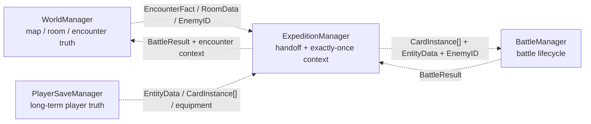

目标闭环要求：

- encounter 事实由 `WorldManager` 上报，不由其拼装长期玩家数据；
- `ExpeditionManager` 只启动一次战斗并只处理一次结果；
- `BattleManager` 不拥有 map 或长期玩家数据；
- 返回时继续使用同一份 `WorldManager.mapdata`；
- 战斗结束后的 signals、callbacks、queue、visual waits、input locks 与 scene references 必须清理；
- `BattleResult`、`EncounterFact` 的正式类型和精确签名尚未实现，保持 `[TARGET][VERIFY]`。

---

# Part V — Current gaps and verification boundary

## 16. 当前实现与目标之间的明确缺口

| Area | 当前事实 | 目标 |
| --- | --- | --- |
| Application flow | `GameManager` 占位；main scene 为空根节点 | `GameManager` 负责 Base ↔ Expedition |
| Expedition coordinator | `ExpeditionManager` 占位且未挂载 | 唯一 explore↔battle coordinator |
| Resident battle scene | `ExpeditionSystem.tscn` 没有 `BattleSystem` | `BattleSystem` 常驻 under `ExpeditionSystem` |
| Battle saved wiring | missing `CombatManager.gd`; `timeline` / `entity_manager` / `enemy_ai` 未绑定 | `BattleManager` 直接协调 Timeline / Entity / Card |
| Encounter report | `WorldManager` 内部直接切 state，无 signal/data contract | report encounter fact to `ExpeditionManager` |
| Battle return | `battle_ended(bool)` 无 receiver | `BattleResult` → `ExpeditionManager` → `WorldManager` |
| Enemy loop | 只实现 initial planning path | action completion 后持续规划，owner 待正式实现 |
| Long-term player state | `PlayerSaveManager` 占位、未挂载 | long-term player authority |
| Expedition save | 只有未挂载且不兼容的 legacy `BattleSaveModule`；没有 World save module | one expedition-level save module |

## 17. 仍为 `[VERIFY]` 的内容

- Editor MCP 未连接，无法核实未保存的 Editor SceneTree、当前打开场景或 Inspector 临时值；本文记录的是磁盘保存态。
- 未进行 runtime execution，不能把脚本意图描述为“运行验证通过”。尤其 `BattleSystem.tscn` 的缺失脚本引用与未绑定依赖会阻断当前链路。
- `[TARGET]` 的 `EncounterFact`、`BattleResult`、`ExpeditionManager` public API、`PlayerSaveManager` save adapter API 与 `ExpeditionSaveModule` snapshot schema 尚未在当前工程定义；本文不 invent signatures。

---

## 18. 维护规则

以下变化需要同步更新本文：

- SceneTree 父子、instanced scene 或 attached script；
- 重要 `@export` Node reference；
- 架构级 public method signature 或 signal；
- `RuntimeCard` / `CombatAction` / entity / encounter / result 等跨系统数据路径；
- authoritative state owner；
- Autoload、main scene、Expedition / World / Battle 顶层装配；
- save module ownership 或 snapshot contract。

更新时继续遵守：结构用实线、运行时流用带类型标签虚线、`Resource` / `RefCounted` 不画成 SceneTree child、当前实现与 `[TARGET]` 分开。
